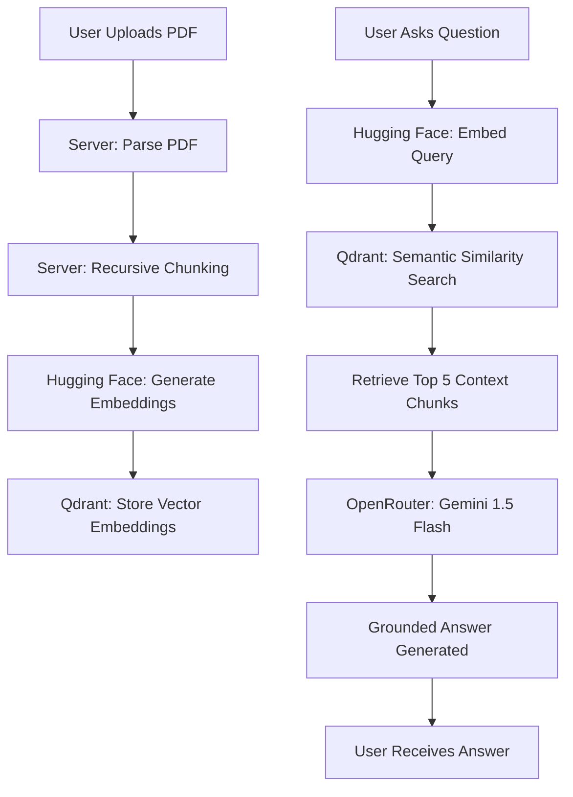

# Notebook RAG 📓🚀

Your own private version of Google NotebookLM. Upload documents and have grounded, context-aware conversations with them. This application uses a Retrieval-Augmented Generation (RAG) pipeline to ensure accuracy and prevent AI hallucinations.

## 🌟 Features

- **📄 PDF Processing:** Seamlessly upload and process PDF documents.
- **✂️ Intelligent Chunking:** Uses `RecursiveCharacterTextSplitter` to preserve semantic context while splitting text into manageable pieces.
- **🔍 Semantic Search:** Powered by **Qdrant Vector Database** and **Hugging Face Embeddings** for lightning-fast, relevant information retrieval.
- **🛡️ Grounded AI:** Answers are strictly derived from your uploaded documents using **Gemini 1.5 Flash**, ensuring high reliability.
- **💻 Modern UI:** A clean, responsive, and intuitive interface built with React, Vite, and Lucide icons.
- **🔄 Fallback Logic:** Robust error handling with automatic model fallback to ensure high availability.

## 🏗️ Project Structure

```text
notebook-rag/
├── client/                # React + Vite Frontend
│   ├── src/
│   │   ├── App.tsx        # Main UI Logic
│   │   ├── App.css        # Styling
│   │   └── main.tsx       # Entry Point
│   └── package.json
├── server/                # Node.js + Express Backend
│   ├── index.js           # API Endpoints & RAG Logic
│   ├── uploads/           # Temporary storage for PDF processing
│   └── package.json
└── README.md
```

## ⚙️ Tech Stack

- **Frontend:** React 19, Vite, Lucide React, Axios, TypeScript
- **Backend:** Node.js, Express, Multer, LangChain
- **AI/RAG:** OpenRouter (Gemini 1.5 Flash), Hugging Face Inference (`all-MiniLM-L6-v2`)
- **Database:** Qdrant (Vector Store)

## 🛠️ Setup Instructions

### 1. Prerequisites
- Node.js (v18+)
- [OpenRouter API Key](https://openrouter.ai/)
- [Hugging Face API Token](https://huggingface.co/settings/tokens)
- A Qdrant instance (Local via Docker or [Qdrant Cloud](https://cloud.qdrant.io/))

### 2. Backend Setup
1. Navigate to the server directory:
   ```bash
   cd server
   ```
2. Create a `.env` file:
   ```env
   PORT=5001
   OPENROUTER_API_KEY=your_openrouter_key
   HUGGINGFACEHUB_API_TOKEN=your_huggingface_token
   QDRANT_URL=your_qdrant_url
   QDRANT_API_KEY=your_qdrant_api_key (optional for local)
   COLLECTION_NAME=notebook-rag
   ```
3. Install dependencies and start the server:
   ```bash
   npm install
   npm start
   ```

### 3. Frontend Setup
1. Navigate to the client directory:
   ```bash
   cd client
   ```
2. (Optional) Create a `.env` file if your backend is not on `localhost:5001`:
   ```env
   VITE_API_URL=http://your-backend-url
   ```
3. Install dependencies and start the development server:
   ```bash
   npm install
   npm run dev
   ```

---

## 🧠 How It Works (RAG Pipeline)

The application follows a standard RAG architecture to provide grounded answers:



### 1. Ingestion & Chunking
- **Strategy:** `RecursiveCharacterTextSplitter`
- **Chunk Size:** 1000 characters | **Overlap:** 200 characters
- **Why?** This ensures that sentences aren't cut in half and that context flows between chunks.

### 2. Embedding & Storage
- **Model:** `sentence-transformers/all-MiniLM-L6-v2` (384 dimensions)
- **Vector DB:** Qdrant is used for efficient similarity search, allowing the system to find relevant document sections in milliseconds.

### 3. Retrieval & Generation
- **Context Retrieval:** The system retrieves the top 5 most relevant chunks for every query.
- **Prompt Engineering:** A strict system prompt forces the LLM to use *only* the provided context. If the answer isn't there, it won't make one up.

---

## 🚀 Future Improvements
- [ ] Support for multiple document uploads.
- [ ] Integration with more file types (Docx, TXT, Markdown).
- [ ] Persistent chat history.
- [ ] Citations with direct links to PDF pages.

## 📄 License
This project is open-source and available under the [ISC License](LICENSE).
